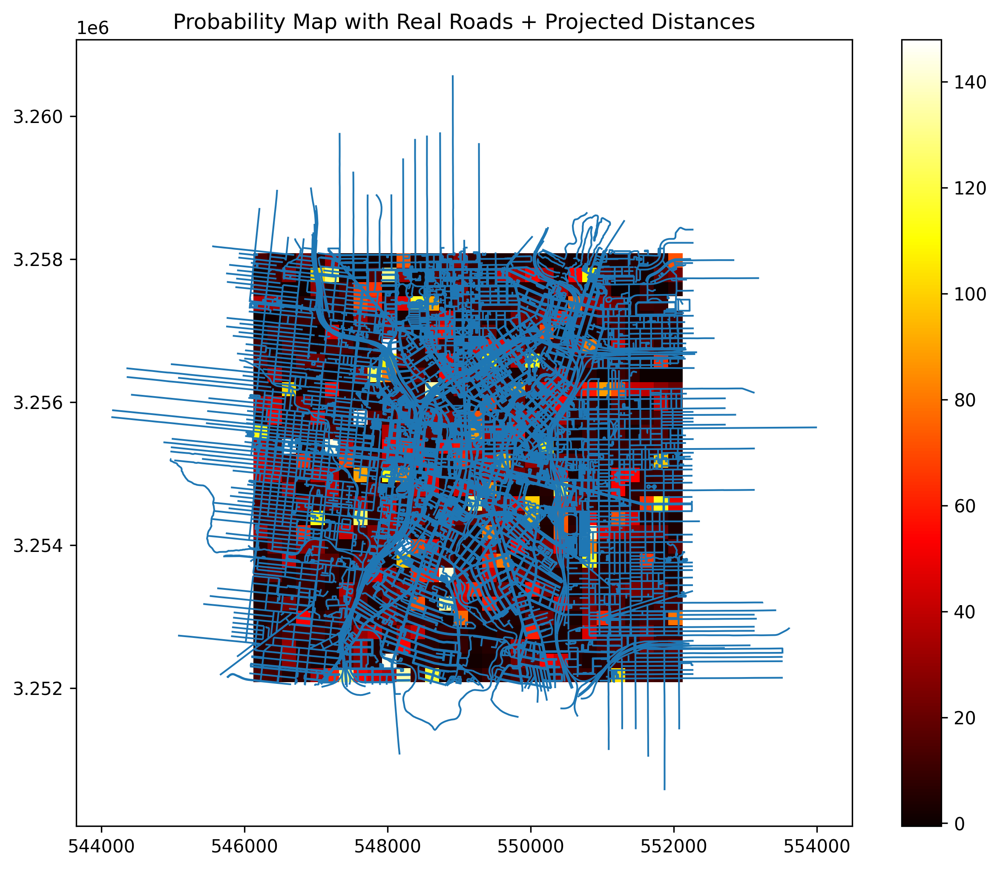
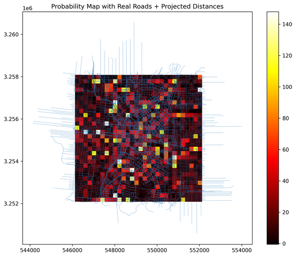
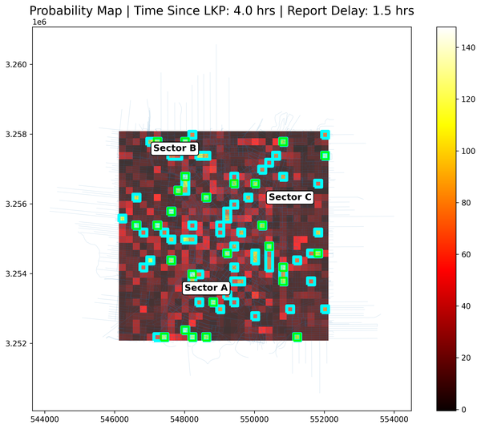
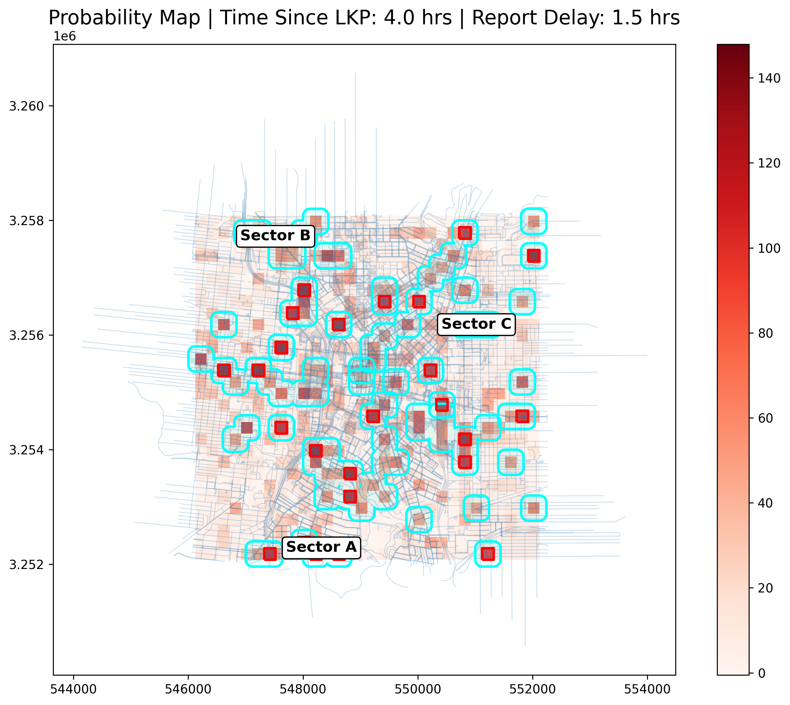
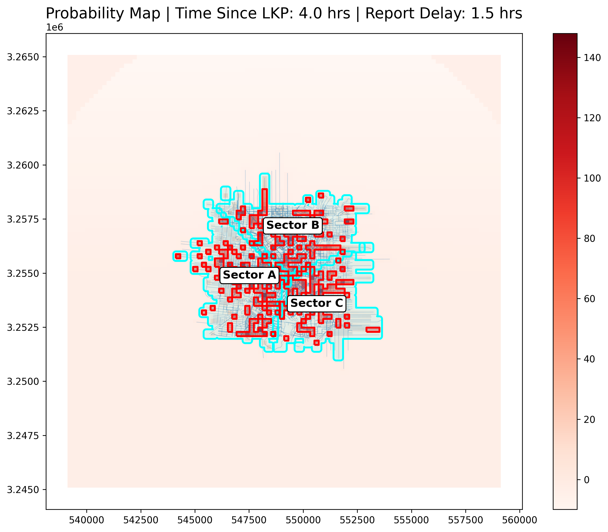
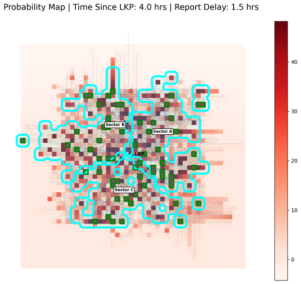
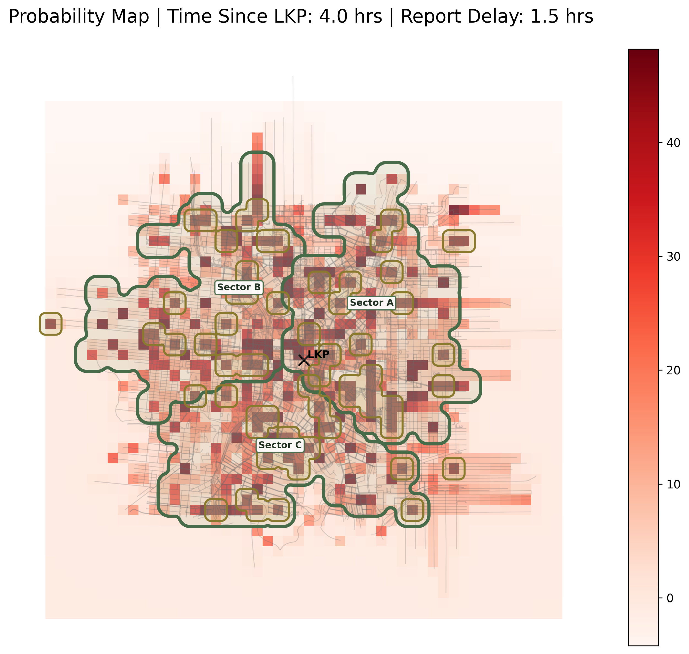
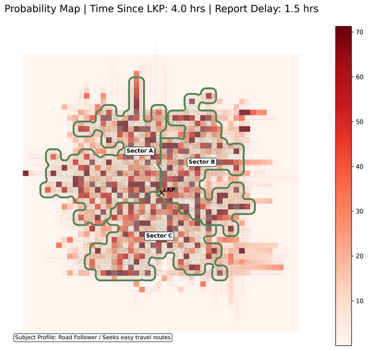
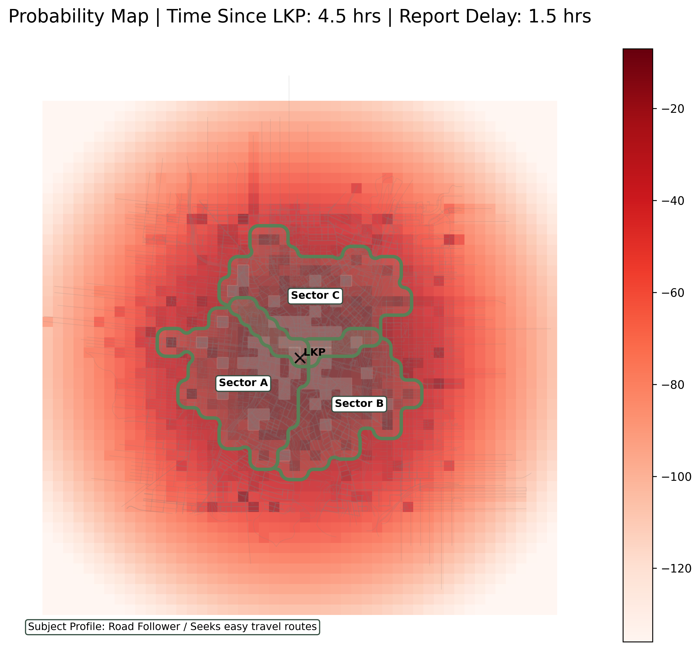
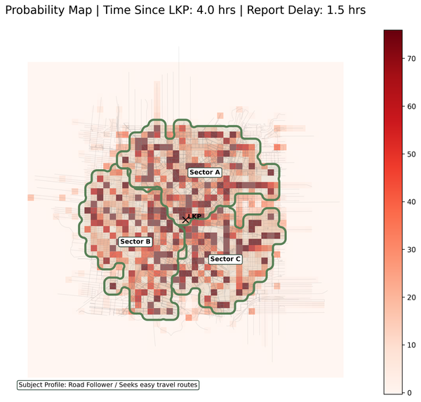

# LandSAR

Terrain-aware search and rescue modeling designed to support real-world decision-making through geospatial analysis and probabilistic simulation.

---

## Overview

LandSAR is a geospatial modeling system that simulates subject movement and generates probable search areas using terrain, access routes, and environmental factors.

The system is designed to move beyond simple mapping and toward operational search planning support.

---

## Key Capabilities

- Monte Carlo-based movement simulation  
- Terrain-aware modeling using elevation and slope  
- Integration of trails, roads, and access features  
- Heatmap generation of probable subject locations  
- Path-density modeling for likely movement corridors  
- Sector-based search prioritization  

---

## Why This Matters

Search and rescue operations are time-critical and resource-limited.

LandSAR is designed to:
- Improve search efficiency  
- Support better resource allocation  
- Provide data-driven search strategies  

---

## Development Status

Active development — core modeling, terrain integration, and simulation systems in progress.

---

## Development History

See full development log:  
[Development Log](docs/devlog.md)

---

## Roadmap

See full development roadmap:  
[Roadmap](docs/roadmap.md)

---

## Images

<h4>
  <a href="images/figure_001_initial_probability.png">
  Phase 1 - Baseline Probability Model
  </a>
</h4>

  

- Radial probability distribution from Last Known Position (LKP)
- No terrain, roads, or behavioral constraints
- Purely mathematical decay model

Why this matters:

This established the foundation for visualizing probability fields and validating the rendering pipeline.

### ───────────────────────────────────────────────────────────────────────

### Phase 2 - Real-World Constraints Introduced

- Integrated real-world road networks (OSMnx)
- Added slope penalty from DEM data
- Particle movement influenced by terrain + infrastructure

Blue lines = simulated movement paths
Heatmap = accumulated probability density

Why this matters:
This marks the transition from a theoretical model to an environment-aware simulation.

### ───────────────────────────────────────────────────────────────────────

### Phase 3 - Real-World Constraints Introduced

- Converted simulation from lat/lon to projected CRS (UTM)
- Enabled accurate distance calculations
- Eliminated geographic distortion

Why this matters:
Geographic coordinates distort distance. This correction ensures real-world movement accuracy.

### ───────────────────────────────────────────────────────────────────────

### Phase 4 — Distance-Based Movement Modeling

**What changed:**

- Movement distance constraints introduced  
- Transition from random dispersion to bounded travel behavior  
- Spatial clustering begins to emerge  

**What you're seeing:**

- Heatmap:
  - Concentrations now reflect reachable zones  
- Road network:
  - Still influencing directional movement  

**Why this matters:**

This is the first step toward modeling **real human movement limitations** instead of abstract spread.

### ───────────────────────────────────────────────────────────────────────

## Phase 5 — Time & Delay Awareness

**What changed:**

- Time since last known point applied  
- Reporting delay incorporated into spread  
- Expansion becomes time-dependent  

**What you're seeing:**

- Wider probability distribution:
  - Increased uncertainty over time  
- Heat zones:
  - Reflect time-adjusted likelihood  

**Why this matters:**

Time is one of the most critical SAR variables — this introduces **temporal realism into the model**.

### ───────────────────────────────────────────────────────────────────────

## Phase 6 — Sectorization (Search Prioritization)

**What changed:**

- Search area divided into priority sectors  
- High-probability zones grouped spatially  
- Non-overlapping operational regions created  

**What you're seeing:**

- Sector A:
  - Highest priority  
- Sector B:
  - Moderate probability  
- Sector C:
  - Lower probability  

**Why this matters:**

This converts analysis into **actionable search assignments**, aligning with real SAR operations.

### ───────────────────────────────────────────────────────────────────────

## Phase 7 — Operational Search Footprint

**What changed:**

- Search areas consolidated into continuous coverage zones  
- Redundant overlap reduced  
- Efficient sweep regions generated  

**What you're seeing:**

- Cyan boundaries:
  - Searchable operational zones  
- Red cells:
  - High-priority targets within sectors  

**Why this matters:**

This represents the transition from modeling to **deployable field strategy**, exactly what SAR teams need.

### ───────────────────────────────────────────────────────────────────────

## Phase 8 — Probability Refinement & Noise Reduction

Improve clarity of probability outputs and reduce visual / statistical noise from raw Monte Carlo results.

**What changed:**

- Smoothed probability heatmaps for better readability
- Reduced random scatter artifacts from particle dispersion
- Tuned weighting so high-probability zones stand out clearly
- Improved contrast between high vs low likelihood areas

**What This Proved:**

- The system produces interpretable outputs, not just raw simulations
- Decision-makers can quickly identify priority areas
- Visual clarity aligns with operational expectations

Clean visualization is critical. A good model is useless if teams can’t interpret it quickly in the field.

### ───────────────────────────────────────────────────────────────────────

## Phase 9 — Time-Based Expansion & Scenario Scaling

Validate how the model behaves as time since LKP increases.

**What changed:**

- Dynamic expansion of probability fields over time
- Scaling of subject travel distance based on elapsed time
- Consistent behavior modeling across multiple time intervals
- Comparison outputs (e.g., 3.7 hrs vs 4.0 hrs vs 4.5 hrs)

**What This Proved:**
- The system maintains logical spatial growth
- High-probability zones evolve instead of randomly shifting
- Model remains stable under changing temporal inputs

Time is the dominant variable in SAR — expansion must be realistic, not exponential chaos.

### ───────────────────────────────────────────────────────────────────────

## Phase 10 — Sector Optimization & Prioritization Logic

Refine sector generation to better match probability distribution and search efficiency.

**What changed:**

- Adjusted sector boundaries to better align with high-density zones
- Reduced overlap and dead space between sectors
- Improved labeling clarity and placement
- Balanced sector sizes for practical deployment

**What This Proved:**

- Sectoring is not just geometric; it is probability-driven
- Search areas can be optimized for coverage + efficiency
- Output is suitable for real-world tasking

Good sectors follow probability, not arbitrary grids.

### ───────────────────────────────────────────────────────────────────────

## Phase 11 — High-Density Sector Scaling (Multi-Sector Deployment)

Scale the system to support larger search operations with more granular control.

**What changed:**

- 12-sector (A–L) configuration
- Target sector sizing (~80,000 sq m)
- Increased granularity for large-area searches
- Maintained non-overlapping sector logic at scale

**What This Proved:**

- The system scales from small team → large coordinated search
- Maintains structure even with complex segmentation
- Supports advanced planning scenarios

### ───────────────────────────────────────────────────────────────────────

## Phase 12 — Pre-UI Operational Output (Command-Ready State)

Finalize backend outputs before UI integration — ensuring the system is operationally valid.

**What changed:**

- Clean map outputs ready for briefing or print
- Integrated:
    - Subject profile
    - Time since LKP
    - Report delay
    - Sector layout
    - Consistent styling across all outputs
    - Readable annotations for command-level use

**What This Proved:**

- The system functions as a standalone SAR planning tool
- Outputs are usable without additional processing
- Ready for UI layer integration

---

## Technical Stack

- Python  
- GeoPandas  
- Rasterio  
- OSMnx  
- PySide6 (UI)  
- Leaflet (mapping)

---

## Notes

Full implementation is not publicly released at this time.