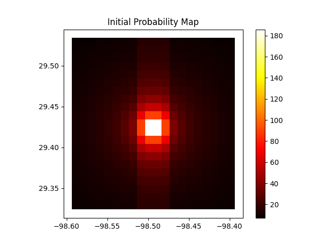
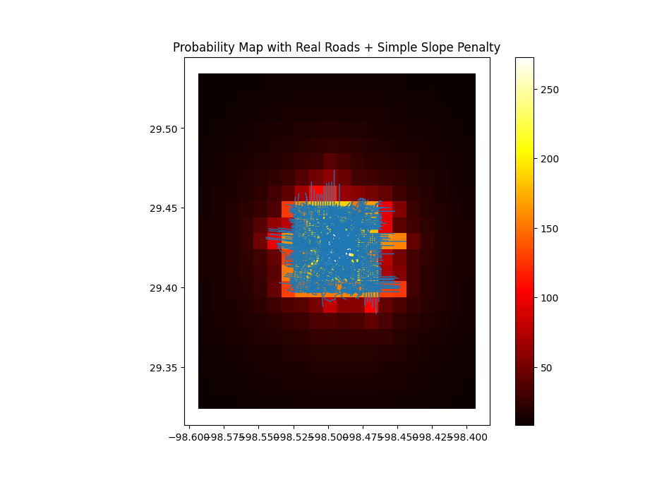

# LandSAR

Terrain-aware search and rescue modeling designed to support real-world decision-making through geospatial analysis and probabilistic simulation.

---

## Overview

LandSAR is a geospatial modeling system that simulates subject movement and generates probable search areas using terrain, access routes, and environmental factors.

The system is designed to move beyond simple mapping and toward operational search planning support.

---

## Key Capabilities

- Monte Carlo-based movement simulation  
- Terrain-aware modeling using elevation and slope  
- Integration of trails, roads, and access features  
- Heatmap generation of probable subject locations  
- Path-density modeling for likely movement corridors  
- Sector-based search prioritization  

---

## Why This Matters

Search and rescue operations are time-critical and resource-limited.

LandSAR is designed to:
- Improve search efficiency  
- Support better resource allocation  
- Provide data-driven search strategies  

---

## Development Status

Active development — core modeling, terrain integration, and simulation systems in progress.

---

## Development History

See full development log:  
[Development Log](docs/devlog.md)

---

## Roadmap

See full development roadmap:  
[Roadmap](docs/roadmap.md)

---

## Screenshots

Baseline Probability Model - Initial Probability Map

Radial probability distribution from Last Known Position (LKP)
No terrain, roads, or behavioral constraints
Purely mathematical decay model

Why this matters:
This established the foundation for visualizing probability fields and validating the rendering pipeline.

Real-World Constraints Introduced - Probability Map with Roads + Simple Slope Penalty

Integrated real-world road networks (OSMnx)
Added slope penalty from DEM data
Particle movement influenced by terrain + infrastructure

What you're seeing:

Blue lines = simulated movement paths
Heatmap = accumulated probability density

Why this matters:
This marks the transition from a theoretical model to an environment-aware simulation.

---

## Technical Stack

- Python  
- GeoPandas  
- Rasterio  
- OSMnx  
- PySide6 (UI)  
- Leaflet (mapping)

---

## Notes

Full implementation is not publicly released at this time.